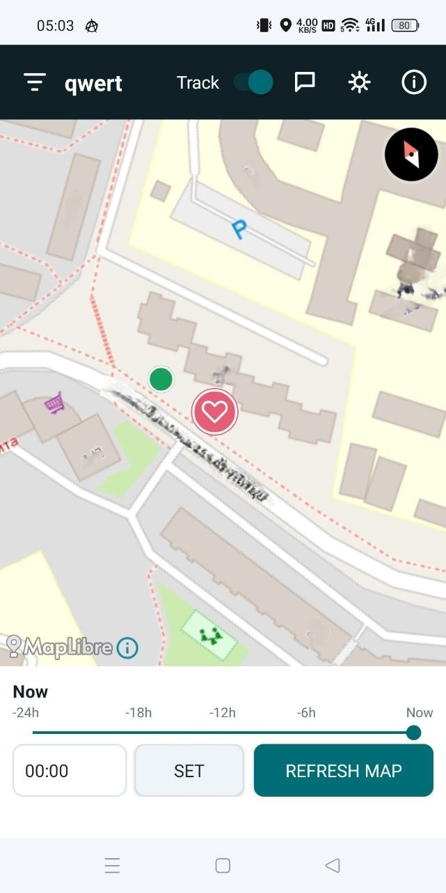
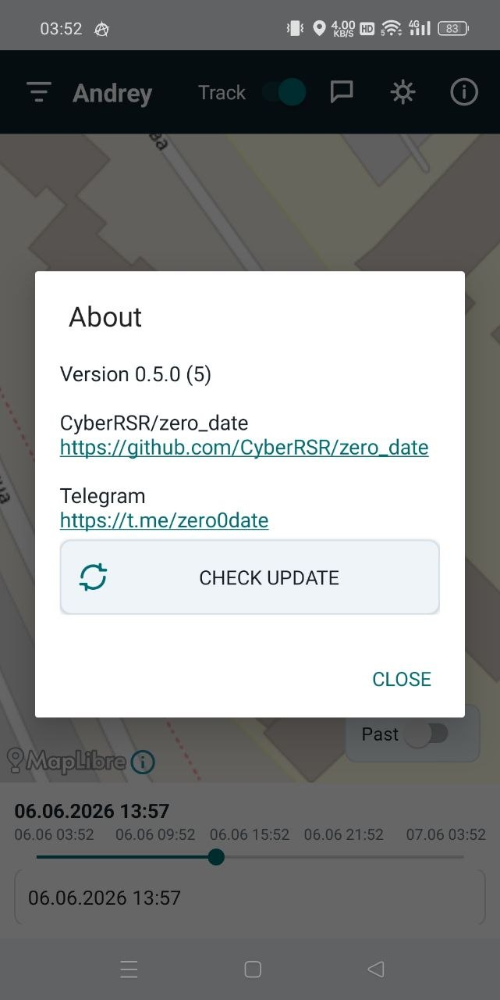
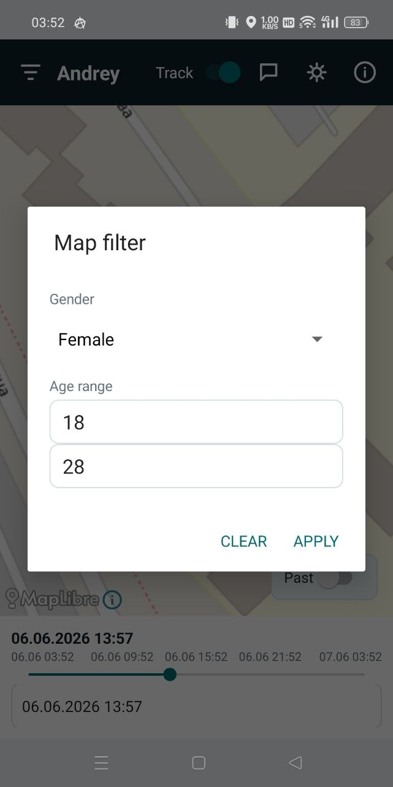
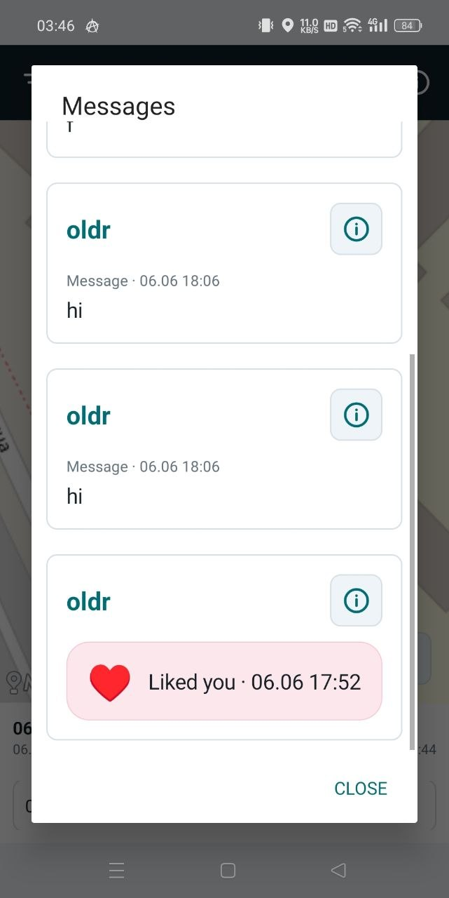
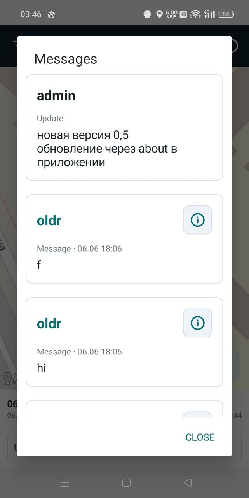
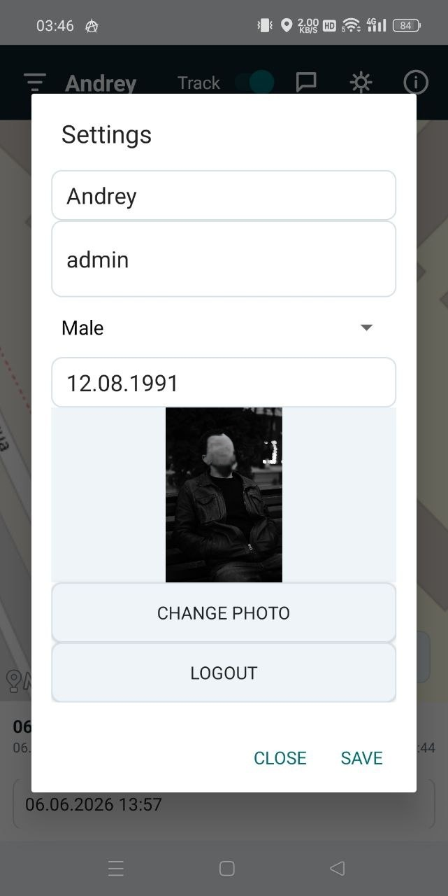
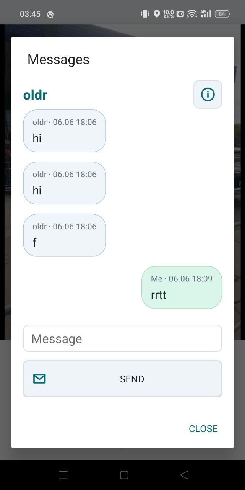
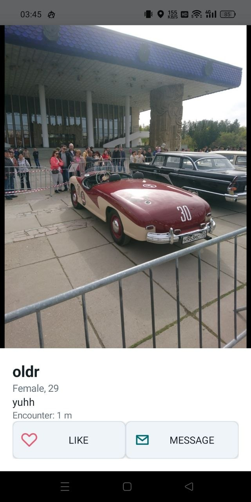
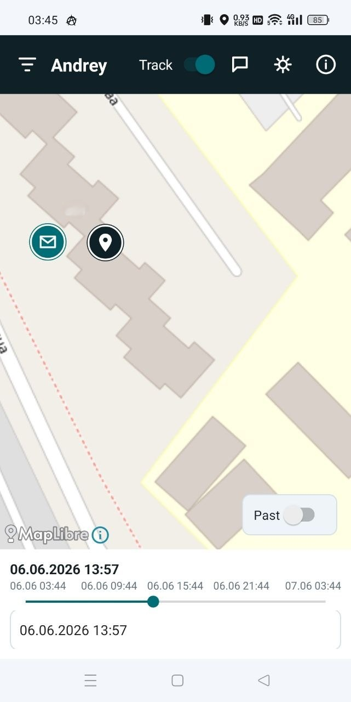

# Zero Date &hearts; &hearts; &hearts;

Zero Date helps you find people you crossed paths with recently, if they also use the app.

&hearts; See matched people on a live map.  
&hearts; Open profile photos fullscreen.  
&hearts; Send likes and messages after a real route crossing.  
&hearts; Get notifications for new likes and messages.  
&hearts; Look back through the last day with an exact time selector.  
&hearts; Filter visible people by gender and age.

## Screenshots

<table>
  <tr>
    <td></td>
    <td></td>
    <td></td>
  </tr>
  <tr>
    <td></td>
    <td></td>
    <td></td>
  </tr>
  <tr>
    <td></td>
    <td></td>
    <td></td>
  </tr>
</table>

## Install

1. Open the latest release:  
   https://github.com/CyberRSR/zero_date/releases/latest
2. Download the APK file.
3. Open the downloaded APK on Android and confirm installation.

Android may ask permission to install apps from your browser or file manager. This is normal for APK installation outside Google Play.

## Update

Open **About** in Zero Date and tap **Check update**.

The app downloads the newest APK from GitHub Releases and opens the Android installer. Android always asks you to confirm the update.

## Tips

Keep **Track** enabled when you want Zero Date to find crossings.

Use a clear profile photo so people can recognize you after a match.

## Community

Telegram: https://t.me/zero0date

GitHub: https://github.com/CyberRSR/zero_date

## Android

Zero Date is an MVP test build for Android 8 and newer.
